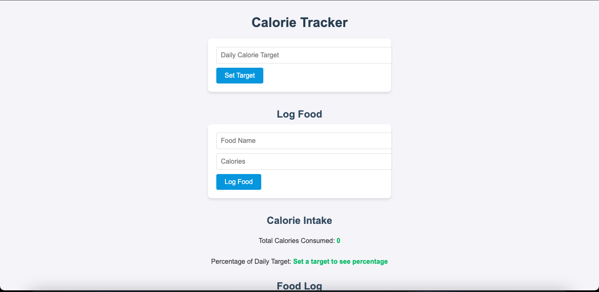
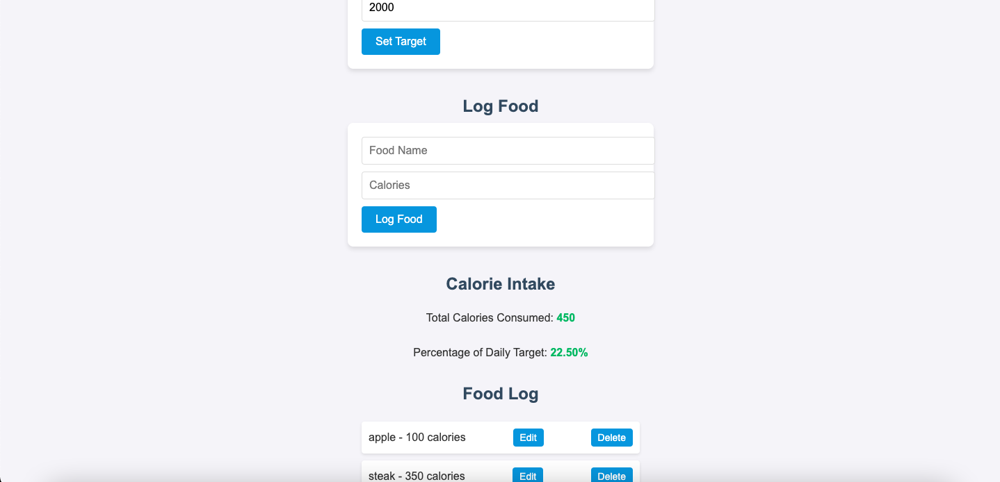

# Mid-Term Project Calorie Tracker

This is the main page of my Calorie Tracker.
Firstly the user inputs the caloric target.
Second step is to log in the food and the amount of calories it has.
Then it logs it in underneath the food log section.

The user for example puts in 2000 calories in the target goal.
Then enters apple for 100 calories.
Also rhe user enters steak for 350 calories.
It then saves the data under food log where the user can edit and delete the food if mistakes were made.
The app also shows the amount of total calories put in.
Also it shows the percentage of how much progress they made for their calorie goal.

